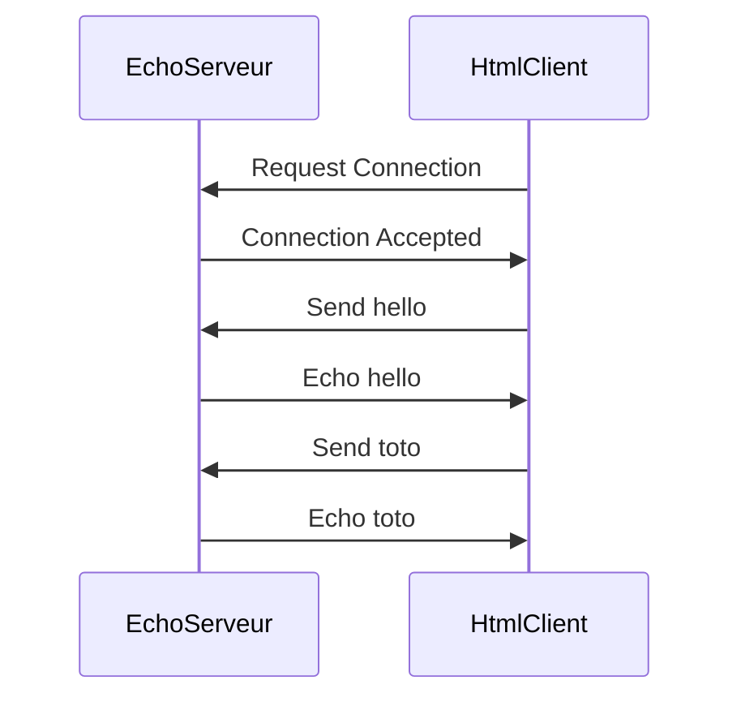
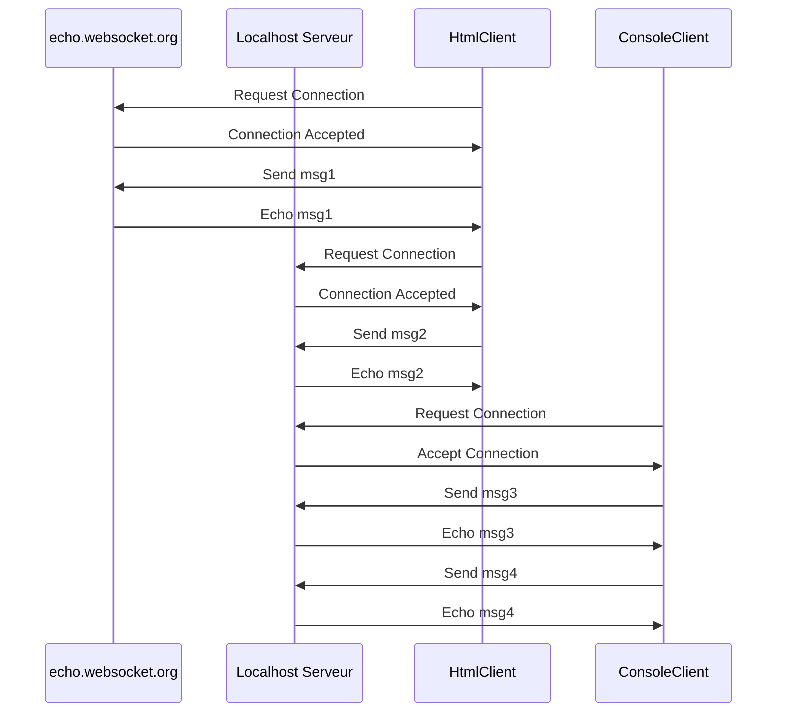
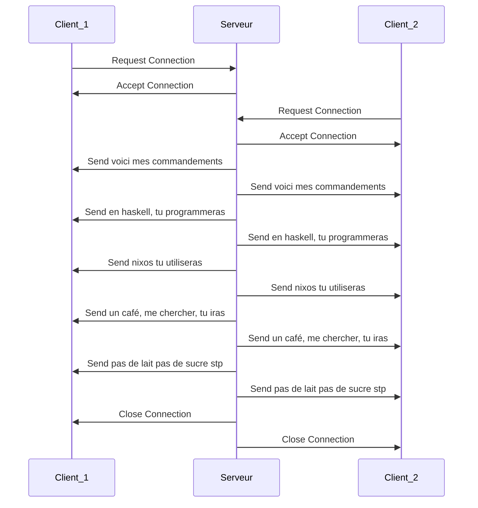

# Echo
## 1.

```mermaid
sequenceDiagram
    participant S as EchoServeur
    participant C as HtmlClient
    C->>S: Request Connection
    S->>C: Connection Accepted
    C->>S: Send hello
    S->>C: Echo hello
    C->>S: Send toto
    S->>C: Echo toto
```

## 2.

```mermaid
sequenceDiagram
    participant S1 as echo.websocket.org
    participant S2 as Localhost Serveur
    participant C1 as HtmlClient
    C1->>S1: Request Connection
    S1->>C1: Connection Accepted
    C1->>S1: Send msg1
    S1->>C1: Echo msg1
    C1->>S2: Request Connection
    S2->>C1: Connection Accepted
    C1->>S2: Send msg2
    S2->>C1: Echo msg2
	participant C2 as ConsoleClient
    C2->>S2: Request Connection
    S2->>C2: Accept Connection
    C2->>S2: Send msg3
    S2->>C2: Echo msg3
    C2->>S2: Send msg4
    S2->>C2: Echo msg4
    destroy C2
```

# Broadcast

```mermaid
sequenceDiagram
	participant C1 as Client_1
	participant S as Serveur
	participant C2 as Client_2
	C1->>S: Request Connection
	S->>C1: Accept Connection
	C2->>S: Request Connection
	S->>C2: Accept Connection
	S->>C1: Send voici mes commandements
	S->>C2: Send voici mes commandements
	S->>C1: Send en haskell, tu programmeras
	S->>C2: Send en haskell, tu programmeras
	S->>C1: Send nixos tu utiliseras
	S->>C2: Send nixos tu utiliseras
	S->>C1: Send un café, me chercher, tu iras
	S->>C2: Send un café, me chercher, tu iras
	S->>C1: Send pas de lait pas de sucre stp
	S->>C2: Send pas de lait pas de sucre stp
	S->>C1: Close Connection
	S->>C2: Close Connection
```
